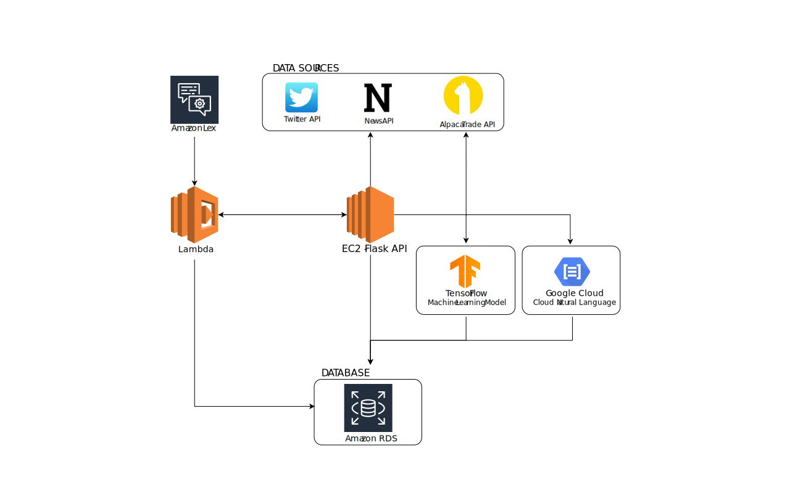
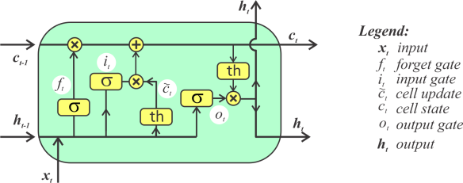
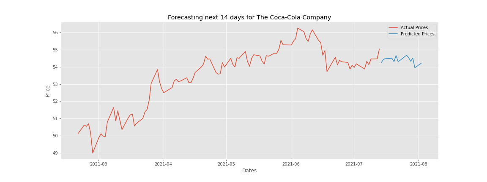

---
**Disclosure**

:warning:   NOT INVESTMENT ADVICE   :warning:

The content produced by this application is for informational purposes only, you should not construe any such information or other material as legal, tax, investment, financial, or other advice. Nothing contained in this article, Git Repo or withing the output produced by this application constitutes a solicitation, recommendation, endorsement, or offer by any member involved working on this project, any company they represent or any third party service provider to buy or sell any securities or other financial instruments in this or in in any other jurisdiction in which such solicitation or offer would be unlawful under the securities laws of such jurisdiction. 

The use of word "recommendation" in this article or any other word with a similar meaning, within the application, or within information produced by the application is for demonstration purposes only, and is not a recommendation to to buy or sell any securities or other financial instruments!

This appliation was created solely to satisfy the requirements of Columbia University FinTech Bootcamp Project #2 Homework, and the results produced by this application may be incorrect.

---

### Table of Contents
* [Overview](#overview)
* [Application Logic](#application-logic)
* [Libraries](#libraries)
* [AWS Interface](#aws-interface)
* [Technical Analysis](#technical-analysis)
* [Machine Learning Model](#machine-learning)
* [Sentiment Analysis](#sentiment-analysis)
* [Team](#team)

---
# Overview

Technitrade lets user track a portfolio of stocks, periodically getting buy, sell, or hold recommendations based on analysis performed by machine learning models and investor sentiment calculated by natural langualge processing analysis of recent news articles and Tweets.

The user interacts with the program via an [Amazon Lex chatbot](#aws-interface). The machine learning analysis is performed using [LSTM (Long Short-Term Memory) model](#machine-learning). The model is trained on [technical analysis indicators](#technical-analysis). Sentiment analysis is performed by [Google Cloud Natural Language](#sentiment-analysis) using NewsAPI and Twitter APIs as data source.

---

# Application Logic



---

# Libraries

The following libraries are used:

### Data and Computation
* [Numpy](https://numpy.org/) - "The fundamental package for scientific computing with Python"
* [Pandas](https://pandas.pydata.org/) - data analysis and manipulation tool

### Data Source APIs
* [Alpaca Trade API](https://alpaca.markets/docs/) - Internet brokerage
* [NewsAPI](https://newsapi.org/) - NewsAPI locates articles and breaking news headlines from news sources and blogs across the web and returns them as JSON.
* [Twitter API](https://developer.twitter.com/en/docs) - Twitter API enables programmatic access to Twitter.

### Machine Learning
* [Tensorflow](https://www.tensorflow.org/) - an end-to-end open source platform for machine learning.
* [Keras](https://keras.io/) - a deep learning API for Python


---

# AWS Interface

1. User provides the service with 10 stocks to track.
2. The service prepares and trains machine learning models for the stock data.
    a. Technical Indicator Backtests 
    b. Sentiment Analysis - Natural Language Processing
3. The service provides user with daily updates about the positions
    a. Buy, sell or hold recommendation
    b. What if scenario - “What if the user bought and held the positions”

---

# Technical Analysis

Technical analysis is performed via <code>technicals</code> module. A demonstration of the module can be seen in <code>[technicals_demo.ipynb](code/technicals/technicals_demo.ipynb)</code>

## Indicators

### Relative Strength Index (RSI)

RSI is a momentum indicator which measures the magnitude of recent price changes to evaluate overbought or oversold conditions in the price of a stock. [[Investopedia](https://www.investopedia.com/terms/r/rsi.asp)]

<details>
<summary> RSI Equation
</summary>
<br>
    
<br>    
where:<br>
    relative strenght (<i>RS</i>) = <i>average gain</i> - <i>average loss</i>
</details>

### William's Percent Range (Williams %R)

Williams %R is a momentum indicator which measures overbought and oversold levels. It has a domain between 0 and -100.The Williams %R may be used to find entry and exit points in the market. [[Investopedia](https://www.investopedia.com/terms/w/williamsr.asp)]

<details>
<summary> Williams %R Equation
</summary>
<br>
    
<br>    
where:<br>
<i>Highest High</i> = Highest price in the lookback period.<br>
<i>Close</i> = Most recent closing price.<br>
<i>Lowest Low</i> = Lowest price in the lookback period.<br>
</details>
    

### Money Flow Index

The money flow index (MFI) is an oscillator that ranges from 0 to 100. It is used to show the money flow (an approximation of the dollar value of a day's trading) over several days. [[Wikipedia](https://en.wikipedia.org/wiki/Money_flow_index)]


<details>
<summary> Money Flow Index Equation
</summary>  
- Positive money flow is calculated by adding the money flow of all the days where the typical price is higher than the previous day's typical price.<br>
- Negative money flow is calculated by adding the money flow of all the days where the typical price is lower than the previous day's typical price.<br>
- If typical price is unchanged then that day is discarded.<br>
- The money flow is divided into positive and negative money flow.<br>
<br>
    
<br> 
    
<br> 
    
<br> 
    
<br> 
</details>


### Stoichastic Oscillator

The stochastic oscillator is a momentum indicator comparing a particular closing price of a security to a range of its prices over a certain period of time. The sensitivity of the oscillator to market movements is reducible by adjusting that time period or by taking a moving average of the result. It is used to generate overbought and oversold trading signals, utilizing a 0–100 bounded range of values. [[Investopedia](https://www.investopedia.com/terms/s/stochasticoscillator.asp)]

<details>
<summary> Stoichastic Oscillator Equation
</summary>  
<br>
    
<br>
where:<br>
    <i>C</i> = The most recent closing price<br>
    <i>Low<sub>n</sub></i> = The lowest price traded of the <i>n</i> previous trading sessions<br>
    <i>High<sub>n</sub></i> = The highest price traded during the same <i>n</i>-day period<br>
    <i>%K</i> = The current value of the stochastic indicator<br>
</details>


### Moving Average Convergence Divergence (MACD)

MACD is a trend-following momentum indicator that shows the relationship between two moving averages of a security’s price. The MACD is calculated by subtracting the 26-period [exponential moving average (EMA)](#exponential-moving-average) from the 12-period EMA. [[Investopedia](https://www.investopedia.com/terms/m/macd.asp)]

<details>
<summary> MACD Equation
</summary>  
<br>
    
<br>
    <a href="https://www.investopedia.com/terms/e/ema.asp">Exponential moving average</a> is a <a href="https://www.investopedia.com/terms/m/movingaverage.asp">moving average</a> that places a greater weight to most recent data points and less to the older data points. In finance, EMA reacts more significantly to recent price changes than a simple moving average (SMA)which applies an equal weight to all observations in the period.
In statistics, a moving average (MA), also known as simple moving average (SMA) in finance, is a calculation used to analyze data points by creating a series of averages of different subsets of the full data set. 
</details>


### Moving Average

The moving average is a calculation used to smooth data and in finance used as a stock indicator. [[Investopedia](https://www.investopedia.com/terms/m/movingaverage.asp)]

<details>
<summary> Moving Average Equation
</summary>  
<br>
    
<br>
where:<br>
    <i>A</i> = Average in period <i>n</i><br>
    <i>n</i> = Number of time periods<br>
</details>


### Exponential Moving Average

The exponential moving average is a type of moving average that gives more weight to recent prices in an attempt to make it more responsive to new information. [[Investopedia](https://www.investopedia.com/terms/m/movingaverage.asp)]

<details>
<summary> EMA Equation
</summary>  
<br>
    
<br>
where:<br>
    <i>EMA<sub>t</sub></i> = EMA today<br>
    <i>EMA<sub>y</sub></i> = = EMA yesterday<br>
    <i>V<sub>t</sub></i> = Value today<br>
    <i>s</i> = smoothing<br>
    <i>d</i> = number of days<br>
</details>


### High Low and Close Open

the high-low and close-open indicators are the difference between the high and low prices of the day and close and open prices of the day respectively.

<details>
<summary> High-Low and Close-Open Equations
</summary>  
<br>
<br>
<br>
</details>


### Bollinger Bands

A Bollinger Band® is a technical analysis tool defined by a set of trendlines plotted two standard deviations (positively and negatively) away from a simple moving average (SMA) of a security's price. Bollinger Bands® were developed and copyrighted by famous technical trader John Bollinger, designed to discover opportunities that give investors a higher probability of properly identifying when an asset is oversold or overbought. [[Bollinger Bands](https://www.bollingerbands.com/bollinger-bands)],[[Investopedia](https://www.investopedia.com/terms/b/bollingerbands.asp)]

<details>
<summary> Bollinger Bands Equation
</summary>  
<br>
<br>
<br>       
where:<br>
    <i>σ</i> = standard deviation<br>
    <i>m</i> = number of standard deviations<br>
    <i>n</i> = number of days in the smoothing period<br>
</details>

---

# Machine Learning Model

## LSTM Model Overview
This application utilizes LSTM (Long Short-Term Memory) machine learning model. LSTM model was developed by Sepp Hochreiter and published in Neural Computation in 1997 [[Hochreiter 1997](https://dl.acm.org/doi/10.1162/neco.1997.9.8.1735)]. A common LSTM unit is composed of a cell, an input gate, an output gate and a forget gate. The cell remembers values over arbitrary time intervals and the three gates regulate the flow of information into and out of the cell [Wikipedia](https://en.wikipedia.org/wiki/Long_short-term_memory). A common LSTM unit is composed of a cell, an input gate, an output gate and a forget gate.



## Data Acquisition

Data is acquired from Alpaca Trade API and processed using the [<code>technicals</code>](code/technicals/technicals.py) module. The resulting dataframe contains <code>Closing</code> price and all of the technical indicators. 

The market data is obtained by calling the <code>ohlcv()</code> method within the [<code>alpaca</code>](code/marketdata/alpaca.py) module. The methods takes a <code>list</code> of tickers, as well as the <code>start_data</code> and <code>end_date</code>, and returns a <code>pd.DataFrame</code>.

```python
end_date  = datetime.now().strftime('%Y-%m-%d')
start_date  = (end_date - timedelta(days=1000)).strftime('%Y-%m-%d')

ohlcv_df = alpaca.ohlcv(['tickers'], start_date=start_date, end_date=end_date)
```

The <code>TechnicalAnalysis</code> class must first be instantiated with the <code>pd.DataFrame</code> containing market data.

```python
tech_ind = technicals.TechnicalAnalysis(ohlcv_df)
tech_ind_df = tech_ind.get_all_technicals('ticker')
```

## LSTM Model Attributes

The LSTM model is contained within the <code>MachineLearningModel</code> class located in the [<code>lstm_model</code>](code/ml/lsmt_model.py) module. The class must first me instantiated with a <code>pd.DataFrame</code> containing the technical analysis data.

```python
model = lstm_model.MachineLearningModel(tech_ind_df)
```

The LSTM model is programmed to look back <code>100</code> days to predict <code>14</code> days. The number of features is set by the shape of the DataFrame.

```python
n_steps_in = 100
n_steps_out = 14
n_features = pd.DataFrame().shape[1]
```

## MachineLearningModel Class Description
The <code>MachineLearningModel</code> class implements the following methodology:

### Scaling
A <code>RobustScaler</code> is used to scale the technical analysis data [[ScikitLearn](https://scikit-learn.org/stable/modules/generated/sklearn.preprocessing.RobustScaler.html)].

```python
sklearn.preprocessing.RobustScaler()
```

Scale features using statistics that are robust to outliers. 

This Scaler removes the median and scales the data according to the quantile range (defaults to IQR: Interquartile Range). The IQR is the range between the 1st quartile (25th quantile) and the 3rd quartile (75th quantile). Centering and scaling happen independently on each feature by computing the relevant statistics on the samples in the training set. Median and interquartile range are then stored to be used on later data using the transform method. 


### Parsing
The dataframe is then parsed to <code>np.array</code> and spit into <code>X</code> and <code>y</code> subsets.

```python
X, y = split_sequence(df.to_numpy(), n_steps_in, n_steps_out)
```

Where <code>split_sequence()</code> is a helper method that splits the multivariate time sequences.

### Model type
<code>Sequential()</code> model is utilized as it groups a linear stack of layers into a [tf.keras.Model](https://www.tensorflow.org/api_docs/python/tf/keras/Model) [[TensorFlow]((https://www.tensorflow.org/api_docs/python/tf/keras/Sequential))]

```python
model = tf.keras.Sequential()
```

### Activation funcation
A hyperbolic tangent activation function is used : <code>tanh</code>[[TensorFlow](https://www.tensorflow.org/api_docs/python/tf/keras/activations/tanh)]

```python
activation_function = tf.keras.activations.tanh
```

### Input and hidden layers
LSTM input and hidden layers are utilized. [[TensorFlow](https://www.tensorflow.org/api_docs/python/tf/keras/layers/LSTM)]

The input layer contains <code>90</code> nodes, while the hidden layers contain <code>30</code> nodes by default but can be set by the administrator to *n* arbitrary amount by setting the <code>n_nodes</code> variable. The number of hidden layers defauls to <code>1</code> but can also be modified by the administrator.

Hidden layers are added with a <code>add_hidden_layers()</code> helper function.

```python
n_nodes = 1

# input layer
model.add(LSTM(90, 
               activation=activation_function, 
               return_sequences=True, 
               input_shape=(n_steps_in, n_features)))

# hidden layers ...
model.add(LSTM(n_nodes, activation=activation, return_sequences=True))
```

### Optimzizer
The model uses Adam optimzer (short for Adaptive Moment Estimation) [[TensorFlow]((https://www.tensorflow.org/api_docs/python/tf/keras/optimizers/Adam))]. Adam is a stochastic gradient descent method that is based on adaptive estimation of first-order and second-order moments. Adam optimzier was developed by Diederik Kingma and Jimmy Ba and published in 2014 [[Kingma et. al. 2014](https://arxiv.org/pdf/1412.6980.pdf)]. Adam optimizer is defined by its creators as "an algorithm for first-order gradient-based optimization of stochastic objective functions, based on adaptive estimates of lower-order moments."

```python
optimizer = tf.keras.optimizers.Adam
```

### Loss function
The model uses Mean Squared Error loss function, which computes the mean of squares of errors between labels and predictions [[TensorFlow](https://www.tensorflow.org/api_docs/python/tf/keras/losses/MeanSquaredError)]

```python
loss = tf.keras.losses.MeanSquaredError
```

### Other model parameters
Model is trained for <code>50</code> epochs using <code>128</code> unit batch size. The validation split is <code>0.1</code>.


### Compiling and fitting

The model is then compiled and fit.

```python
model.compile(optimizer='adam', loss='mse', metrics=['accuracy'])
res = model.fit(X, y, epochs=50, batch_size=128, validation_split=0.1)
```

## Run model
All of the aforemetioned tasks are run by calling the <code>build_model()</code> class method withing the MachineLearningModel class.

```python
hist = model.build_model()
```

The model is then saved as an <code>.h5</code> file.

```python
model.save_model('model.h5')
```

## Results

An example of model training results with conducted with The Coca-Cola Company stock : KO. 

### Accuracy


### Loss


### Predictions
Predictions are calculated with a <code>validater()</code> helper method.


## Forecasting stock prices
### Implementation
To forecast stock prices using the saved model, the application uses the <code>ForecastPrice</code> class located within the [<code>lstm_model</code>](code/ml/lsmt_model.py) module.

The module pre-processes the date using the aforementioned methods and then utilizes <code.model.predict()</code> TensorFlow method.

The application accomplished this by:

1. Getting stock prices for past <code>200</code> days using <code>alpaca</code> module
2. Getting technical indicators usign the <code>get_all_technicals()</code> method withing the <code>technicals.TechnicalAnalysis</code> class
3. Instantiating the <code>ForecastPrice</code> class with the technical data

```python
forecast_model = lstm_model.ForecastPrice(ohlcv_df)
```

4. Calling <code>forecast()</code> method within the <code>ForecastPrice</code> class

```python
forecast = forecast_model.forecast()
```

### Result



If the predicted price <code>14</code> days from now is higher than the current price, the application will issue a buy "recommentaion", if the price is lower that the current price it will issue a sell "recommentaion" on the date of the highest predicted price.

---

# Sentiment Analysis

* Natural Language Processing data source:
    1. NewsAPI 
    2. Twitter
* Google Cloud Natural Language - Pre-trained model
    * Get sentiment
    * https://cloud.google.com/natural-language/docs/analyzing-sentiment
* Fit model with new data daily provide user with probability of returns


---

# Team

* [Fernando Bastos](https://www.linkedin.com/in/fdobastos/)
* [Shaunjay Brown](https://www.linkedin.com/in/shaun-jay-brown-933b7437/)
* [Illya Nayshevsky, Ph.D.](http://www.illya.bio)
